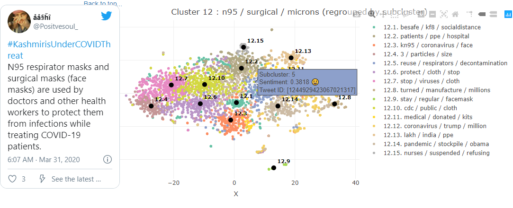

# COVID-masks-nlp
Dataset and code for our paper: Unmasking the conversation on masks: Natural language processing for topical sentiment analysis of COVID-19 Twitter discourse

The clusters from the paper can be explored in our pre-rendered interactive notebook:

[https://therensselaeridea.github.io/COVID-masks-nlp/analysis/twitter.html](https://therensselaeridea.github.io/COVID-masks-nlp/analysis/twitter.html)



# Getting Started
Follow this guide to set up the data collection and analysis pipeline described in the paper, and import our mask-wearing tweet dataset.

## 1. Prerequisites
### Elasticsearch
Elasticsearch version 7.x or greater is required. Get it at [https://www.elastic.co/elasticsearch/](https://www.elastic.co/elasticsearch/) or install it using your favorite package manager.

### Twitter Developer account
In order to download tweets by ID or collect them from the streaming API, a Twitter Developer account is required.
If you don't have one already, you can apply at [https://developer.twitter.com/en/apply-for-access](https://developer.twitter.com/en/apply-for-access).

## 2. Setup
### 2.1 Clone or download this repository & install Python dependencies
We recommend creating a virtual environment with Python 3.7 or greater.
```shell
pip install -r requirements.txt
```

### 2.2 Import some tweets into Elasticsearch
You have two options - import tweets from a list of tweet IDs such as our mask-wearing tweet dataset, or use the Twitter stream API to gather tweets in real-time.

#### 2.2.1 Configure your Twitter credentials and Elasticsearch settings
In [twitter_monitor/config.json](twitter_monitor/config.json), set your twitter developer account credentials
and the location of your elasticsearch instance.

`elasticsearch_index_name` is the name of the elasticsearch index into which tweets will be imported. This index will be
created if it does not exist. The name `coronavirus-data-masks` is what we used for our mask-wearing dataset, but this can be
set to anything.
```json
"api_key": "YOUR_API_KEY_HERE",
"api_secret_key": "YOUR_SECRET_KEY_HERE",
"access_token": "YOUR_ACCESS_TOKEN HERE",
"access_token_secret": "YOUR_ACCESS_TOKEN_SECRET_HERE",
"elasticsearch_host": "localhost",
"elasticsearch_verify_certs": false,
"elasticsearch_index_name": "coronavirus-data-masks"
```

#### 2.2.2 Import tweets from a list of tweet IDs
We have provided a script [twitter_montor/jsonl_dataset_loader.py](twitter_montor/jsonl_dataset_loader.py) capable of hydrating and importing
tweets from a collection of flat files, where each line is either a tweet ID or a json object ([JSON Lines](http://jsonlines.org/examples/) format) containing a tweet ID and related metadata.

To import the mask-wearing dataset included in this repository:
```shell
python jsonl_dataset_loader.py --datasetglob=./../tweet_ids/*/*.txt
```

To import from a directory `data` of JSON Lines files where the tweet ID is located in the `tweet_id` field of each json object:
```shell
python jsonl_dataset_loader.py \
  --datasetglob=./../data/*.jsonl \
  --tweetidfieldname=tweet_id
```
When importing from a JSON Lines format, any additional fields present in each json object will be imported into Elasticsearch alongside
the downloaded tweet JSON.

#### 2.2.3 Use the Twitter stream API to gather tweets in real-time
In [twitter_monitor/config.json](twitter_monitor/config.json), set your filter languages and keywords. 
Only tweets containing these keywords (non case-sensitive) will be retrieved.
```json
"filter_languages": ["en"],
"filter_keywords": [
    "some",
    "interesting",
    "keywords",
    "here"
]
```
Then to start retrieving tweets in real-time, run:
```shell
python twitter_monitor.py
```
It is possible to maintain multiple configuration files if ingesting into multiple Elasticsearch indicies simultaneously
with different keyword lists:
```shell
python twitter_monitor.py \
  --configfile=specific_config.json \
  --logfile=specific_tmlog.txt
```

### 2.3 Compute embeddings and sentiment scores for the imported tweets
Our analysis pipeline works best when tweets have sentence embeddings and sentiment scores stored alongside them in Elasticsearch.

#### 2.3.1 Compute embeddings for the imported tweets
We have provided a tool that continuously monitors an Elasticsearch index for tweets with no embeddings. When such tweets are found,
the embeddings are computed and the tweet is updated in Elasticsearch with the vector.

In [embedder/config.json](embedder/config.json), set the location of your elasticsearch instance.
`elasticsearch_index_name` is the name of the index that will be monitored.
```json
"elasticsearch_host": "localhost",
"elasticsearch_verify_certs": false,
"elasticsearch_index_name": "coronavirus-data-masks",
```

Then, start the embedder tool:
```shell
python embedder.py
```
Or
```shell
python embedder.py \
  --configfile=specific_config.json \
  --logfile=specific_embedderlog.txt
```
If using the Stream API to collect tweets in real-time, we recommend configuring this script to run as service / daemon so that
newly collected tweets are immediately embedded and available to the analysis pipeline.

#### 2.3.2 Compute sentiment scores for the imported tweets
We have provided a sentiment scoring tool that is configured and run identically to the embedder tool (see instructions above).
Configure [sentiment/config.json](sentiment/config.json) and run [sentiment/sentiment.py](sentiment/sentiment.py).

### 2.4 Start the embedding and summarization model web servers
To avoid loading the full embedding and summarization models into the R analysis pipeline notebook, these functionalities are exposed
using flask web servers.

To start the embedding web server:
```shell
python embed_server.py --port=8008
```

To start the summarization web server:
```shell
python summarize_server.py --port=8080
```
We recommend running the summarization web server on a machine with an nvidia GPU. If no GPU is available, it will run on the CPU
with significantly slower inference times.

To experiment with other BART summarization model instances from HuggingFace, you can add any model available at [https://huggingface.co/models?search=bart](https://huggingface.co/models?search=bart) to [summarizer/config.json](summarizer/config.json):
```json
"transformers_models": [
    "sshleifer/distilbart-xsum-12-6", 
    "sshleifer/distilbart-cnn-12-6"
],
```

## 3. Using the R analysis pipeline notebook
Open [analysis/twitter.Rmd](analysis/twitter.Rmd) in a [knitr](https://yihui.org/knitr/) enabled R environment. We recommend using [RStudio](https://rstudio.com/).

### 3.1 Set the notebook snapshot mode (optional)
The analysis pipeline can take several hours to run on larger sample sizes of tweets. For this reason we have implemented a snapshot
system that allows the environment state from previous runs to be pre-loaded and only the visualization code executed. Usage of the snapshot system is explained int he header comments of the notebook. Snapshots should be saved to and loaded from the [analysis/snapshots](analysis/snapshots) directory.

By default, no snapshot is saved or loaded.

```R
snapshot_mode:
    input: select
    choices: ["none", "save", "load"]
    value: "none"

snapshot_name: ""

snapshot_path: "/COVID-masks-nlp/analysis/snapshots"
```

### 3.2 Set the server resource locations:
The notebook must know where your Elasticsearch instance and model servers are located:
```R
# Set server resource locations here:
elasticsearch_index <- "coronavirus-data-masks"
elasticsearch_host <- "localhost"
elasticsearch_path <- ""
elasticsearch_port <- 9200
elasticsearch_schema <- "http"

embedder_url <- "http://localhost:8008/embed/use_large/"
summarizer_url <- "http://localhost:8080/batchsummarize"
```

### 3.3 Set the search parameters, hyperparameters, and output settings
The search parameters and hyperparameters included in the repository are the same used in the paper.

To change them, use the code chunks in the following sections:
```R
### Configure the search parameters here:
...

### Configure the hyperparameters here:
...

### Configure the output settings here:
...
```

If you are using your own tweet dataset, adjust the `rangestart`, `rangeend`, `plot_range_start`, and `plot_range_end`
date ranges accordingly. 

Filters can be applied on :

- tweet text with `text_filter`
- tweet location with `location_filter` and `must_have_geo`
- sentiment score with `sentiment_lower` and `sentiment_upper`

Additionally, tweets can be ordered by semantic similarity to an example phrase with `semantic_phrase`.

### 3.4 Knit to HTML
The notebook will not work as a PDF or any format other than HTML.